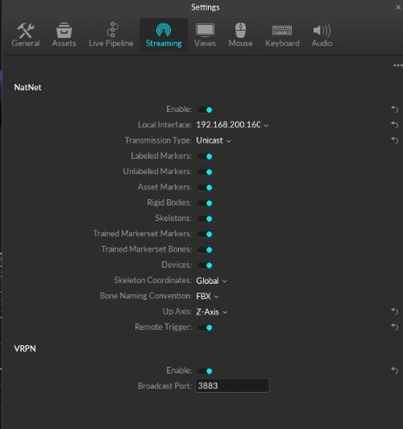

# GMR: General Motion Retargeting


  <a href="https://arxiv.org/abs/2505.02833">
    
  </a>
  <a href="https://opensource.org/licenses/MIT">
    
  </a>
  <a href="https://github.com/YanjieZe/GMR/releases">
    
  </a>
  <a href="https://x.com/ZeYanjie/status/1952446745696469334">
    
  </a>
  <a href="https://yanjieze.github.io/humanoid-foundation/#GMR">
    
  </a>


Key features of GMR:
- Real-time high-quality retargeting, unlock the potential of real-time whole-body teleoperation, i.e., [TWIST](https://github.com/YanjieZe/TWIST).
- Carefully tuned for good performance of RL tracking policies.
- Support multiple humanoid robots and multiple human motion data formats (See our table below).

**NOTE: If you want this repo to support a new robot or a new human motion data format, send the robot files (`.xml` (must), `.urdf` (must), and meshes (must)) / human motion data to <a href="mailto:lastyanjieze@gmail.com">Yanjie Ze</a> or create an issue, we will support it as soon as possible.** Please make sure the robot files you sent can be open-sourced in this repo.

This repo is licensed under the [MIT License](LICENSE).

Starting from its release, GMR is massively used by the community. See below for cool papers that use GMR:
- [arXiv 2025.08](https://arxiv.org/abs/2508.21043), *HITTER: A HumanoId Table TEnnis Robot via Hierarchical Planning and Learning*
- [arXiv 2025.08](https://arxiv.org/abs/2508.13444), *Switch4EAI: Leveraging Console Game Platform for Benchmarking Robotic Athletics*
- [arXiv 2025.05](https://arxiv.org/abs/2505.02833), *TWIST: Teleoperated Whole-Body Imitation System*

 # To Do List
 - [ ] add doc on ik config offset
 - [ ] support xsens data


# News & Updates
- 2025-08-30: GMR now supports [Unitree H1 2](https://www.unitree.com/cn/h1) and [PND Adam Lite](https://pndbotics.com/), the 12th and 13th humanoid robots in the repo.
- 2025-08-28: GMR now supports [Booster T1](https://www.boosterobotics.com/) for both 23dof and 29dof.
- 2025-08-28: GMR now supports using exported offline FBX motion data from [OptiTrack](https://www.optitrack.com/). 
- 2025-08-27: GMR now supports [Berkeley Humanoid Lite](https://github.com/HybridRobotics/Berkeley-Humanoid-Lite-Assets), the 11th humanoid robot in the repo.
- 2025-08-24: GMR now supports [Unitree H1](https://www.unitree.com/h1/), the 10th humanoid robot in the repo.
- 2025-08-24: GMR now supports velocity limits for the robot motors, `use_velocity_limit=True` by default in `GeneralMotionRetargeting` class (and we use 3*pi as the velocity limit by default); we also add printing of robot DoF/Body/Motor names and their IDs by default, and you can access them via `robot_dof_names`, `robot_body_names`, and `robot_motor_names` attributes.
- 2025-08-10: GMR now supports [Booster K1](https://www.boosterobotics.com/), the 9th robot in the repo.
- 2025-08-09: GMR now supports *Unitree G1 with Dex31 hands*.
- 2025-08-07: GMR now supports [Galexea R1 Pro](https://galaxea-dynamics.com/) (this is a wheeled humanoid robot!) and [KUAVO](https://www.kuavo.ai/), the 7th and 8th humanoid robots in the repo.
- 2025-08-06: GMR now supports [HighTorque Hi](https://www.hightorquerobotics.com/hi/), the 6th humanoid robot in the repo.
- 2025-08-04: Initial release of GMR. Check our [twitter post](https://x.com/ZeYanjie/status/1952446745696469334).


# Demo

Demo 1: Retargeting LAFAN1 dancing motion to 5 different robots (Unitree G1, Booster T1, Stanford ToddlerBot, Fourier N1, and ENGINEAI PM01):


https://github.com/user-attachments/assets/23566fa5-6335-46b9-957b-4b26aed11b9e

Demo 2: Galexea R1 Pro, a wheeled humanoid robot, doing human motion


https://github.com/user-attachments/assets/903ed0b0-0ac5-4226-8f82-5a88631e9b7c


https://github.com/user-attachments/assets/deea0e64-f1c6-41bc-8661-351682006d5d


Demo 3: Screen recording of my one command line usage. Switch robots with just changign an argument.


https://github.com/user-attachments/assets/03f10902-c541-40b1-8104-715a5759fd5e

Demo 4: HighTorque robot doing a twist dance


https://github.com/user-attachments/assets/1d3e663b-f29e-41b1-8e15-5c0deb6a4a5c

Demo 5: Kuavo robot picking up a box


https://github.com/user-attachments/assets/02fc8f41-c363-484b-a329-4f4e83ed5b80

Demo 6: Unitree H1 doing ChaCha dance


https://github.com/user-attachments/assets/28ee6f0f-be30-42bb-8543-cf1152d97724


Demo 7: Booster T1 23dof/29dof doing some jumping


https://github.com/user-attachments/assets/2c75a146-e28f-4327-930f-5281bfc2ca9c


https://github.com/user-attachments/assets/ff10c7ef-4357-4789-9219-23c6db8dba6d


Demo 8: Unitree H1 2 doing some jumping


https://github.com/user-attachments/assets/2382d8ce-7902-432f-ab45-348a11eeb312


Demo 9: PND Adam lite


https://github.com/user-attachments/assets/a8ef1409-88f1-4393-9cd0-d2b14216d2a4


# Supported Robots and Data Formats

| Assigned ID | Robot/Data Format | Robot DoF | SMPLX ([AMASS](https://amass.is.tue.mpg.de/), [OMOMO](https://github.com/lijiaman/omomo_release)) | BVH ( [LAFAN1](https://github.com/ubisoft/ubisoft-laforge-animation-dataset)) | FBX ([OptiTrack](https://www.optitrack.com/)) | More formats coming soon | 
| --- | --- | --- | --- | --- | --- | --- |
| 0 | Unitree G1 `unitree_g1` | Leg (2\*6) + Waist (3) + Arm (2\*7) = 29 | ✅ | ✅ | ✅ |
| 1 | Unitree G1 with Hands `unitree_g1_with_hands` | Leg (2\*6) + Waist (3) + Arm (2\*7) + Hand (2\*7) = 43 | ✅ | ✅ | ✅ |
| 2 | Unitree H1 `unitree_h1` | Leg (2\*5) + Waist (1) + Arm (2\*4) = 19 | ✅ | TBD | TBD |
| 3 | Unitree H1 2 `unitree_h1_2` | Leg (2\*6) + Waist (1) + Arm (2\*7) = 27 | ✅ | TBD | TBD |
| 4 | Booster T1 `booster_t1` | TBD | ✅ |  TBD  | TBD |
| 5 | Booster T1 29dof `booster_t1_29dof` | TBD | ✅ |  ✅  | TBD | 
| 6 | Booster K1 `booster_k1` | Neck (2) + Arm (2\*4) + Leg (2\*6) = 22 | ✅ | TBD | TBD |
| 7 | Stanford ToddlerBot `stanford_toddy` | TBD | ✅ | ✅ | TBD |
| 8 | Fourier N1 `fourier_n1` | TBD | ✅ | ✅ | TBD |
| 9 | ENGINEAI PM01 `engineai_pm01` | TBD | ✅ | ✅ | TBD |
| 10 | HighTorque Hi `hightorque_hi` | Head (2) + Arm (2\*5) + Waist (1) + Leg (2\*6) = 25 | ✅ | TBD | TBD |
| 11 | Galaxea R1 Pro `galaxea_r1pro` (this is a wheeled robot!) |  Base (6) + Torso (4) + Arm (2*7) = 24 | ✅ | TBD | TBD |
| 12 | Kuavo `kuavo_s45` |  Head (2) + Arm (2\*7) + Leg (2\*6) = 28 | ✅ | TBD | TBD |
| 13 | Berkeley Humanoid Lite `berkeley_humanoid_lite` (need further tuning) | Leg (2\*6) + Arm (2\*5) = 22 | ✅ | TBD | TBD |
| 14 | PND Adam Lite `pnd_adam_lite`  | Leg (2\*6) + Waist (3) + Arm (2\*5) = 25 | ✅ | TBD | TBD |
| More robots coming soon ! |
| 15 | AgiBot A2 `agibot_a2` | TBD | TBD | TBD | TBD |
| 16 | OpenLoong `openloong` | TBD | TBD | TBD | TBD |


# Installation

The code is tested on Ubuntu 22.04/20.04.

```bash
# create conda env
conda create -n gmr python=3.10 -y
conda activate gmr

# install GMR
pip install -e .

# NOTE: after install SMPLX, change `ext` in `smplx/body_models.py` from `npz` to `pkl` if you are using SMPL-X pkl files.

# to resolve some possible rendering issues
conda install -c conda-forge libstdcxx-ng -y
```


# Data Preparation

[[SMPLX](https://github.com/vchoutas/smplx) body model] download SMPL-X body models to `assets/body_models` from [SMPL-X](https://smpl-x.is.tue.mpg.de/) and then structure as follows:
```bash
- assets/body_models/smplx/
-- SMPLX_NEUTRAL.pkl
-- SMPLX_FEMALE.pkl
-- SMPLX_MALE.pkl
```

[[AMASS](https://amass.is.tue.mpg.de/) motion data] download raw SMPL-X data to any folder you want from [AMASS](https://amass.is.tue.mpg.de/). NOTE: Do not download SMPL+H data.

[[OMOMO](https://github.com/lijiaman/omomo_release) motion data] download raw OMOMO data to any folder you want from [this google drive file](https://drive.google.com/file/d/1tZVqLB7II0whI-Qjz-z-AU3ponSEyAmm/view?usp=sharing). And process the data into the SMPL-X format using `scripts/convert_omomo_to_smplx.py`.

[[LAFAN1](https://github.com/ubisoft/ubisoft-laforge-animation-dataset) motion data] download raw LAFAN1 bvh files from [the official repo](https://github.com/ubisoft/ubisoft-laforge-animation-dataset), i.e., [lafan1.zip](https://github.com/ubisoft/ubisoft-laforge-animation-dataset/blob/master/lafan1/lafan1.zip).


# Human/Robot Motion Data Formulation

To better use this library, you can first have an understanding of the human motion data we use and the robot motion data we obtain.

Each frame of **human motion data** is formulated as a dict of (human_body_name, 3d global translation + global rotation).

Each frame of **robot motion data** can be understood as a tuple of (robot_base_translation, robot_base_rotation, robot_joint_positions).


# Usage

## Retargeting from SMPL-X (AMASS, OMOMO) to Robot

**NOTE: after install SMPL-X, change `ext` in `smplx/body_models.py` from `npz` to `pkl` if you are using SMPL-X pkl files.**


Retarget a single motion:
```bash
# single motion
python scripts/smplx_to_robot.py --smplx_file <path_to_smplx_data> --robot <path_to_robot_data> --save_path <path_to_save_robot_data.pkl> --rate_limit
```
By default you should see the visualization of the retargeted robot motion in a mujoco window.
If you want to record video, add `--record_video` and `--video_path <your_video_path,mp4>`.
- `--rate_limit` is used to limit the rate of the retargeted robot motion to keep the same as the human motion. If you want it as fast as possible, remove `--rate_limit`.


Retarget a folder of motions:
```bash
python scripts/smplx_to_robot_dataset.py --src_folder <path_to_dir_of_smplx_data> --tgt_folder <path_to_dir_to_save_robot_data> --robot <robot_name>
```
By default there is no visualization for batch retargeting.


## Retargeting from BVH (LAFAN1) to Robot

Retarget a single motion:
```bash
# single motion
python scripts/bvh_to_robot.py --bvh_file <path_to_bvh_data> --robot <path_to_robot_data> --save_path <path_to_save_robot_data.pkl> --rate_limit
```
By default you should see the visualization of the retargeted robot motion in a mujoco window. 
- `--rate_limit` is used to limit the rate of the retargeted robot motion to keep the same as the human motion. If you want it as fast as possible, remove `--rate_limit`.


Retarget a folder of motions:
```bash
python scripts/bvh_to_robot_dataset.py --src_folder <path_to_dir_of_bvh_data> --tgt_folder <path_to_dir_to_save_robot_data> --robot <robot_name>
```
By default there is no visualization for batch retargeting.


## Retargeting from FBX (OptiTrack) to Robot
### Offline FBX Files
Retarget a single motion:
1. Install `fbx_sdk` by following [these instructions](https://github.com/nv-tlabs/ASE/tree/main/ase/poselib#importing-from-fbx) and [these instructions](https://github.com/nv-tlabs/ASE/issues/61#issuecomment-2670315114). You will probably need a new conda environment for this.
2. Activate the conda environment where you installed `fbx_sdk`.
Use the following command to extract motion data from your `.fbx` file:
```bash
cd third_party
python poselib/fbx_importer.py --input <path_to_fbx_file.fbx> --output <path_to_save_motion_data.pkl> --root-joint <root_joint_name> --fps <fps>
```
3. Then, run the command below to retarget the extracted motion data to your robot:
```bash
conda activate gmr
# single motion
python scripts/fbx_offline_to_robot.py --motion_file <path_to_saved_motion_data.pkl> --robot <path_to_robot_data> --save_path <path_to_save_robot_data.pkl> --rate_limit
```
By default you should see the visualization of the retargeted robot motion in a mujoco window. 
- `--rate_limit` is used to limit the rate of the retargeted robot motion to keep the same as the human motion. If you want it as fast as possible, remove `--rate_limit`.


### Online Streaming

We provide the script to use OptiTrack MoCap data for real-time streaming and retargeting.

Usually you will have two computers, one is the server that installed with Motive (Desktop APP for OptiTrack) and the other is the client that installed with GMR.

Find the server ip (the computer that installed with Motive) and client ip (your computer). Set the streaming as follows:



And then run:
```bash
python scripts/optitrack_to_robot.py --server_ip <server_ip> --client_ip <client_ip> --use_multicast False --robot unitree_g1
```
You should see the visualization of the retargeted robot motion in a mujoco window.


## Visualize saved robot motion
```bash
python scripts/vis_robot_motion.py --robot <robot_name> --robot_motion_path <path_to_save_robot_data.pkl>
```
If you want to record video, add `--record_video` and `--video_path <your_video_path,mp4>`.


# Speed Benchmark

| CPU | Retargeting Speed |
| --- | --- |
| AMD Ryzen Threadripper 7960X 24-Cores | 60~70 FPS |
| 13th Gen Intel Core i9-13900K 24-Cores | 35~45 FPS |
| TBD | TBD |


# Citation

If you find our code useful, please consider citing our papers:

```bibtex
@article{ze2025twist,
title={TWIST: Teleoperated Whole-Body Imitation System},
author= {Yanjie Ze and Zixuan Chen and João Pedro Araújo and Zi-ang Cao and Xue Bin Peng and Jiajun Wu and C. Karen Liu},
year= {2025},
journal= {arXiv preprint arXiv:2505.02833}
}
```
and this github repo:
```bibtex
@software{ze2025gmr,
title={GMR: General Motion Retargeting},
author= {Yanjie Ze and João Pedro Araújo and Jiajun Wu and C. Karen Liu},
year= {2025},
url= {https://github.com/YanjieZe/GMR},
note= {GitHub repository}
}
```
# Known Issues

Designing a single config for all different humans is not trivial. We observe some motions might have bad retargeting results. If you observe some bad results, please let us know! We now have a collection of such motions in [TEST_MOTIONS.md](TEST_MOTIONS.md).


# Acknowledgement
Our IK solver is built upon [mink](https://github.com/kevinzakka/mink) and [mujoco](https://github.com/google-deepmind/mujoco). Our visualization is built upon [mujoco](https://github.com/google-deepmind/mujoco). The human motion data we try includes [AMASS](https://amass.is.tue.mpg.de/), [OMOMO](https://github.com/lijiaman/omomo_release), and [LAFAN1](https://github.com/ubisoft/ubisoft-laforge-animation-dataset).

The original robot models can be found at the following locations:

* Booster T1: [Official website](https://booster.feishu.cn/wiki/UvowwBes1iNvvUkoeeVc3p5wnUg) ([English](https://booster.feishu.cn/wiki/DtFgwVXYxiBT8BksUPjcOwG4n4f)).
* [EngineAI PM01](https://github.com/engineai-robotics/engineai_ros2_workspace): [Link to file](https://github.com/engineai-robotics/engineai_ros2_workspace/blob/community/src/simulation/mujoco/assets/resource) 
* [Fourier N1](https://github.com/FFTAI/Wiki-GRx-Gym): [Link to file](https://github.com/FFTAI/Wiki-GRx-Gym/tree/FourierN1/legged_gym/resources/robots/N1)
* [Toddlerbot](https://github.com/hshi74/toddlerbot): [Link to file](https://github.com/hshi74/toddlerbot/tree/main/toddlerbot/descriptions/toddlerbot_active)
* [Unitree G1](https://github.com/unitreerobotics/unitree_ros): [Link to file](https://github.com/unitreerobotics/unitree_ros/tree/master/robots/g1_description)
* [HighToqure Hi](https://www.hightorquerobotics.com/hi/)
* [Galaxea R1 Pro](https://galaxea-dynamics.com/): MIT license
* [LEJU Kuavo S45](https://gitee.com/leju-robot/kuavo-ros-opensource/blob/master/LICENSE): MIT license
* [Berkley Humanoid Lite](https://github.com/HybridRobotics/Berkeley-Humanoid-Lite-Assets): CC-BY-SA-4.0 license
* [Booster K1](https://www.boosterobotics.com/)
